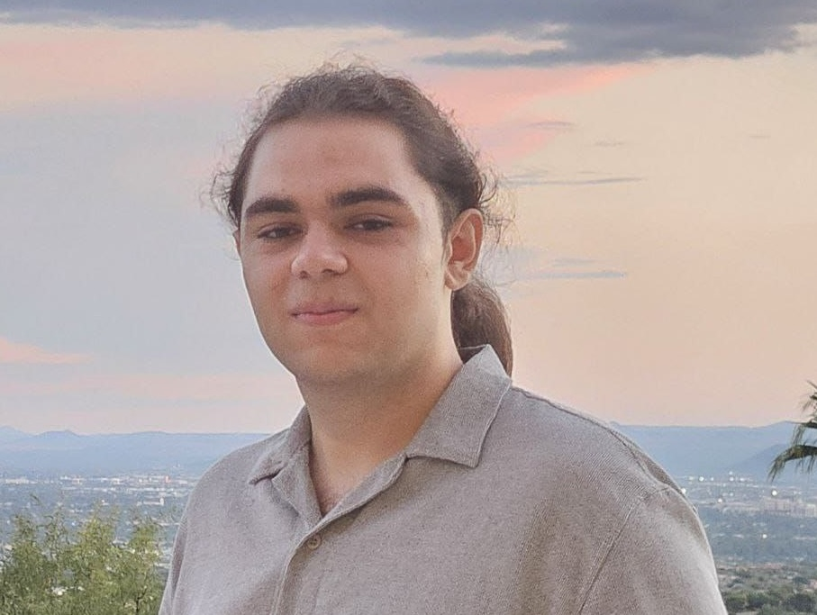

  <!-- Sidebar -->
  <aside class="sidebar">

    

    <h2 style="margin-bottom: 0.2em;">Arshia Akhtarkavan</h2>

    

    Undergraduate researcher 
    Physics • Mathematics • Astronomy 
     University of Arizona
    

    

    <i class="fas fa-location-dot"></i>
    Steward Observatory, Tucson, AZ
    

    

    <!-- This is a comment -->
    <!-- Links section -->

    <h3>Links</h3>
    <ul>
    <li>
        <a href="https://github.com/AaKavan">
        <i class="fab fa-github"></i> GitHub
        </a>
    </li>
    <li>
        <a href="https://scholar.google.com/citations?user=F8KI1M8AAAAJ">
        <i class="fas fa-graduation-cap"></i> Google Scholar
        </a>
    </li>
    <li>
        <a href="https://orcid.org/0009-0003-7532-3197">
        <i class="fab fa-orcid"></i> ORCID
        </a>
    </li>
    <li>
        <a href="cv/CV_Arshia_Akhtarkavan.pdf">
        <i class="fas fa-file-pdf"></i> CV (PDF)
        </a>
    </li>
    </ul>

    

    <!-- Contacts section -->

    <h3>Contact</h3>

    

    <i class="fas fa-envelope"></i>
    <a href="mailto:aakhtarkavan@arizona.edu">
        aakhtarkavan@arizona.edu
    </a>
    

    

    <i class="fas fa-envelope"></i>
    <a href="mailto:arshiakavan.public@gmail.com">
        arshiakavan.public@gmail.com
    </a>
    

    </aside>

  <!-- Main content -->
  <main class="main-column">

    <nav style="margin-bottom: 2em; font-weight: 600;">
      <a href="/">Home</a> |
      <a href="publications">Publications</a> |
      <a href="cv">CV</a>
    </nav>

    <h1>About</h1>

    

      Hello! I’m <strong>Arshia Akhtarkavan</strong>, and this is my personal website.
      I will be adding more about my research interests as time goes on.
      This website is still in development, so stay tuned!
    

    

      I am currently an undergraduate student at the University of Arizona.
      I’ve always been interested in space, so I am triple majoring in Physics,
      Mathematics, and Astronomy.
    

    

      My research focuses on high-redshift galaxies using JWST/NIRCam,
      where I am currently working on modeling galaxy kinematics.
    

    <h2>Education</h2>

    

      <strong>University of Arizona</strong>, Tucson, AZ 
      Bachelor of Science in Physics and Mathematics,
      minor in Astronomy <em>(Expected Spring 2027)</em>
    

    

      <strong>Atomic Energy High School</strong>, Tehran, Iran 
      High School Diploma <em>(Spring 2023)</em> 
      Completed via SABA International School, Frankfurt, Germany
    

    <h2>Awards & Scholarships</h2>

    <ul>
      <li>Kenneth S. Krane Physics Scholarship (2025–2026)</li>
      <li>Evelyn O. Bychinsky Promising Astronomer Award (2025–2026)</li>
      <li>RII-Sponsored Campuswide Undergraduate Student-Initiated Original Research (2025–2026)</li>
      <li>Glenn C. Purviance Scholarship in Physics (2023–2024)</li>
      <li>Global Wildcat Tuition Award, University of Arizona (2023–present)</li>
      <li>Silver Medal, National Astronomy and Astrophysics Olympiad (2022)</li>
    </ul>

  </main>

